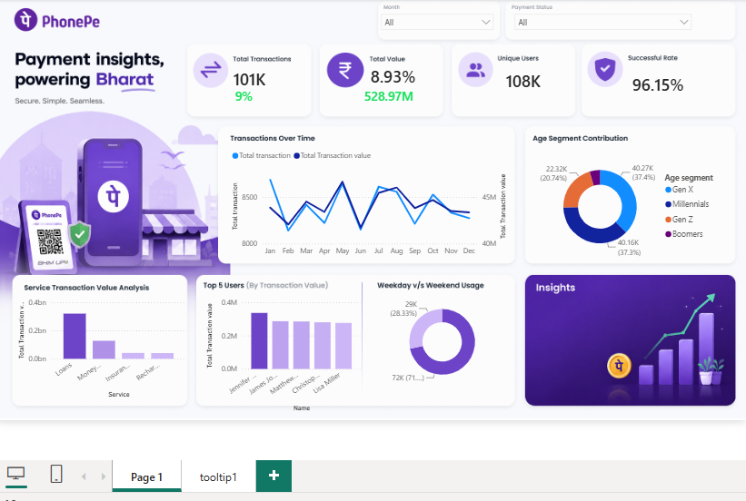

# 📊 PhonePe Transaction Analysis Dashboard

## 📌 Project Overview

This project is an interactive **Power BI dashboard** developed to analyze PhonePe transaction data and identify important patterns in transaction activity, user behavior, service performance, and payment success rates.

The dashboard provides an interactive view of key business metrics using **KPIs, charts, slicers, and visual analytics**.

---

## 🎯 Project Objectives

* Analyze overall transaction performance.
* Track transaction trends over time.
* Analyze transaction value across different services.
* Understand user distribution across age segments.
* Compare user activity across different users.
* Analyze weekday vs. weekend transaction behavior.
* Monitor payment success rate.
* Identify useful business insights from the data.

---

## 🛠️ Tools & Technologies

* **Power BI**
* **Power Query**
* **DAX**
* **Excel**
* **Data Visualization**

---

## 🔄 Project Workflow

The project was developed using the following workflow:

**Raw Data → Data Cleaning → Data Transformation → Data Modeling → DAX Measures → Dashboard Development → Business Insights**

### 1. Data Cleaning & Transformation

Power Query was used to prepare the data for analysis, including:

* Handling missing or inconsistent values
* Transforming data types
* Preparing tables for analysis
* Creating required calculated fields

### 2. Data Modeling

The data was organized into appropriate tables and relationships to support efficient analysis and interactive reporting.

### 3. DAX

DAX measures were created to calculate important KPIs and analytical metrics such as:

* Total Transactions
* Total Transaction Value
* Unique Users
* Successful Transactions
* Success Rate
* Transaction trends

---

## 📈 Dashboard KPIs

The dashboard provides an overview of important metrics including:

| KPI                     |    Value |
| ----------------------- | -------: |
| Total Transactions      |     101K |
| Total Transaction Value | ₹528.97M |
| Unique Users            |     108K |
| Success Rate            |   96.15% |

*Values shown above represent the current dashboard view.*

---

## 📊 Dashboard Features

### Transaction Analysis

The dashboard analyzes transaction activity over time and helps identify changes and trends in transaction volume and transaction value.

### Age Segment Analysis

Users are categorized into different age segments such as:

* Gen X
* Millennials
* Gen Z
* Boomers

This helps understand the contribution of different customer segments.

### Service Transaction Analysis

Transaction value is analyzed across different PhonePe services, helping compare the performance of different transaction categories.

### User Analysis

The dashboard provides analysis of top users based on transaction value.

### Weekday vs Weekend Analysis

Transaction behavior is compared between weekdays and weekends to understand differences in user activity.

### Payment Success Analysis

The dashboard tracks successful transactions and calculates the overall payment success rate.

---

## 🎛️ Interactive Features

The dashboard includes interactive elements such as:

* Month filter
* Payment Status filter
* Interactive charts
* KPI cards
* Cross-filtering
* Drill-through functionality
* Dynamic DAX measures

These features allow users to explore the data according to their requirements.

---

## 💡 Key Insights

Based on the current dashboard:

* The overall payment success rate is approximately **96.15%**, indicating a high proportion of successful transactions.
* The dashboard shows transaction trends across different months to identify changes in transaction activity.
* Different age segments contribute significantly to the overall user base.
* Service-wise analysis helps identify which PhonePe services contribute more transaction value.
* User-level analysis helps identify high-value users.
* Weekday and weekend analysis provides insights into differences in customer transaction behavior.

---

## 📷 Dashboard Preview

Add your clean dashboard screenshot below:

```markdown

```

---

## 📁 Project Files

* `phonepay.pbix` — Power BI project file
* `dashboard.png` — Dashboard preview

---

## 🚀 How to Use

1. Download the `.pbix` file from this repository.
2. Open the file using **Microsoft Power BI Desktop**.
3. Use the available slicers and visualizations to interact with the dashboard.
4. Explore transaction trends, user behavior, service performance, and payment success metrics.

---

## 🧠 Skills Demonstrated

**Data Analytics:** Data Cleaning, Data Transformation, Data Analysis

**Power BI:** Dashboard Development, Data Modeling, Interactive Visualizations

**DAX:** Measures, KPI Calculations, Analytical Calculations

**Power Query:** Data Preparation and Transformation

---

## 👨‍💻 Author

**Bhavesh Singhal**

Data Analyst | Power BI | SQL | Excel | DAX
